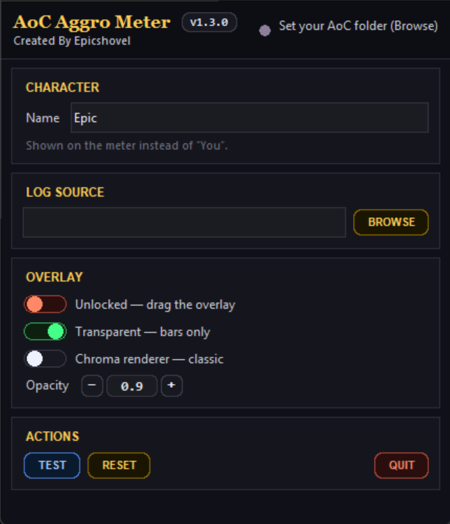
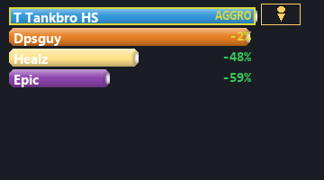
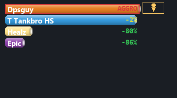

# AoC Aggro Meter

Standalone Age of Conan **threat / aggro meter overlay**.

Created By **EpicShovel**

It tails your live `CombatLog*.txt`, keeps an estimated threat table per mob, and shows on a borderless, always-on-top overlay who currently **HAS aggro** and how close everyone else is to pulling it — so you see the danger **before** the mob turns.

Only **reads** the game's combat log — nothing is injected into Age of Conan.

## Features

- Estimated threat per player (damage × class/hate/stance multipliers, taunts, threat dumps) fused with **observed** aggro (who the mob actually hits) — the estimate snaps to reality when they disagree.
- Tank badges, class colours, per-row pull margin (`+N%` over / `−N%` room vs the holder), red **AGGRO LOST** state when aggro sits on a non-tank, tank taunt-rotation strip.
- DPS-style glass bars; optional per-pixel-alpha **layered renderer** (Overlay card toggle) or classic chroma mode.
- **Transparent = bars-only mode** — the whole background disappears and only the bars float over the game; click the **pin button** on the overlay to flip between bars-only and the opaque card.
- Fully offline, no dependencies beyond an optional Pillow; config in `%APPDATA%\AoC Aggro Meter`.

## Screenshots

## Install

1. Download `AoC_Aggro_Meter_Setup_1.4.1.exe` from this repository (or from [Releases](https://github.com/EpicShovel/aoc-aggro-meter/releases/latest)).
2. Run the installer. It is signed, but with a self-issued certificate, so Windows shows the publisher as **Requiem Nex** and may warn "unknown publisher" the first time — click More info > Run anyway, or run `Trust-RequiemNex.bat` (installed next to the app).
3. In-game, enable combat logging once: `/logcombat on`
4. Fight something — the overlay appears and tracks threat.

**v1.4.1 is a threat-accuracy release.** The numbers on the board are meaningfully different from 1.3.x — a two-tank rotation no longer inflates the tanks against everyone else, a Goad no longer hands the mob back to the DPS four seconds later, healing during a lull is no longer thrown away, and "Stranger" (the game's label for anyone it can't resolve) can no longer occupy a row or hold aggro. See the [release notes](https://github.com/EpicShovel/aoc-aggro-meter/releases/latest).

Upgrading from 1.3.0 or earlier on a scaled display (125%, 150%, …)? v1.3.1 fixed a long-standing DPI bug, so the overlay may need repositioning once after that update — the previously saved coordinates were virtualized.

## License

All rights reserved — EpicShovel.
